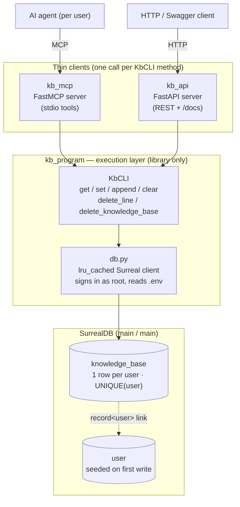

# Knowledge-Base Experiment (Internship)

A per-user **knowledge base (KB)** for an AI agent that manages a separate
SurrealDB-backed **task manager** application. Each user has their own agent, and each
agent has its own KB — persistent memory about how to manage that user's tasks. The KB is a
nested **Notion/Outline-style document tree** (folders + documents); the agent reaches both
the tasks and its KB over **MCP**, and a **Flutter app** (`kb_flutter/`) is the human-facing
editor. (An earlier single-markdown-file design is kept as a legacy surface.)

> **TL;DR for newcomers:** the active, supported code is **`kb_backend/`** (Python +
> SurrealDB + MCP) and **`kb_flutter/`** (the Flutter editor). The **`KbApp/`** folder is an
> earlier C# prototype that has been **superseded** and is kept only for reference. Start
> with [`kb_backend/`](#3-kb_backend--active-python--surrealdb--mcp).

---

## 1. Background — how the pieces fit

There are **two separate systems** in play. Only one of them lives in this repo.

| System | Where it lives | Role |
|--------|----------------|------|
| **Task manager app** | *Not in this repo* (described in the brief) | A Python CLI + MCP + REST app over SurrealDB that manages `task` / `activity` / `comment` records. The agent drives it over MCP. |
| **Knowledge base** | **This repo, `kb_backend/`** | Stores each user's notes/memory as a nested document tree (plus a legacy single-file surface). Lives in the **same SurrealDB instance** as the task app and links to its `user` table. |

The KB now models a **nested folder/document tree** (`document` table, self-referencing
`parent`): every node is a document, a *folder* is just a document with children, and each
user sees their own **Personal** subtree plus a shared **Team** subtree. The original
single-markdown-file design (`knowledge_base` table) is retained as a legacy surface. (An
even earlier C# prototype, `KbApp/`, modelled folders via path strings; this tree supersedes
both, unified on SurrealDB.) Single-user for now: the `owner` field is additive-ready
structure, not yet an auth boundary.

```
┌─────────────┐        MCP         ┌──────────────────────┐
│  The agent  │ ─────────────────▶ │  task app (elsewhere)│ ─┐
│ (per user)  │                    │   task/activity/...  │  │
│             │ ─────────────────▶ │  kb_backend (here)   │  │   same SurrealDB
└─────────────┘        MCP         │   knowledge_base     │ ─┘   (main / main)
                                   └──────────────────────┘
```

Because the KB and the task app share one SurrealDB database and one `user` table, the
agent that already manages tasks can also read and update its own knowledge base.

---

## 2. Repository layout

```
.
├── README.md                  # this file
├── kb_backend/                # ★ ACTIVE: Python + SurrealDB + MCP knowledge base
│   ├── schema.surql           #   fresh-install schema (task tables + knowledge_base + document)
│   ├── reset.surql            #   wipe all records, keep the schema
│   ├── kb_program/            #   execution layer (library only)
│   │   ├── db.py              #     cached SurrealDB client, reads .env, signs in as root
│   │   ├── _common.py        #     shared helpers (query shapes, RecordID coercion, user seeding)
│   │   ├── models.py         #     KnowledgeBase + Document dataclasses + KbError
│   │   ├── program.py        #     KbCLI: get / set / append / clear (legacy single file)
│   │   └── documents.py      #     DocumentCLI: the nested document tree (CRUD + move)
│   ├── kb_mcp/                #   MCP server client
│   │   ├── server.py         #     FastMCP tools: KB tools + document-tree tools
│   │   └── __main__.py       #     `python -m kb_mcp`
│   ├── kb_api/                #   REST server client
│   │   ├── server.py         #     FastAPI endpoints: /knowledge-base* + /documents*
│   │   └── __main__.py       #     `python -m kb_api`
│   ├── pyproject.toml         #   package + optional [mcp] / [api] extras
│   ├── .env.example           #   credential template
│   └── README.md              #   quickstart for this package
│
├── kb_flutter/                # ★ ACTIVE: Flutter editor over the document tree
│   └── lib/                   #   go_router + riverpod + dio; sidebar tree + markdown editor
│
└── KbApp/                      # ✗ LEGACY: C# .NET prototype, superseded (kept for reference)
    └── KbApp.Api/             #   ASP.NET Core Web API, EF Core + SQLite (Documents CRUD)
```

---

## 3. `kb_backend/` — active (Python + SurrealDB + MCP)

This is the real deliverable. Its architecture mirrors the task app's conventions: a
client-agnostic **execution layer** (`kb_program`) plus thin **clients** (`kb_mcp`,
`kb_api`) that wrap it. Direct SurrealDB SDK calls, no ORM/repository layer.



KbError raised in `KbCLI` is surfaced to callers as a structured value — `Error: ...` over
MCP, an HTTP `400 {"detail": ...}` over REST — never a traceback.

### 3.1 Data model

The KB is one row per user in a `knowledge_base` table:

| Field | Type | Notes |
|-------|------|-------|
| `user` | `record<user>` | Owner. Links to the task app's `user` table. A **UNIQUE index** enforces one KB per user. |
| `content` | `string` (default `''`) | The whole markdown file. |
| `created_at` | `datetime` | Set once on creation. |
| `updated_at` | `datetime` | Bumped by the backend on every write (`time::now()`). |

```surql
DEFINE TABLE IF NOT EXISTS knowledge_base SCHEMAFULL;
DEFINE FIELD IF NOT EXISTS user       ON knowledge_base TYPE record<user>;
DEFINE FIELD IF NOT EXISTS content    ON knowledge_base TYPE string DEFAULT '';
DEFINE FIELD IF NOT EXISTS created_at ON knowledge_base TYPE datetime DEFAULT time::now();
DEFINE FIELD IF NOT EXISTS updated_at ON knowledge_base TYPE datetime DEFAULT time::now();
DEFINE INDEX IF NOT EXISTS knowledge_base_user ON knowledge_base FIELDS user UNIQUE;
```

**`schema.surql` is a complete fresh-install schema.** It contains the task app's full
schema verbatim (`user`, `project`, `task`, `activity`, `comment` + their indexes) **and**
the `knowledge_base` table above. Importing it into a brand-new, empty SurrealDB instance
therefore produces a fully working environment for testing the agent end-to-end (tasks +
KB) with no dependency on the task app having been imported first. Every statement is
idempotent (`DEFINE ... IF NOT EXISTS`), so it is also safe to run against an instance that
already has the task tables.

### 3.2 Execution layer (`kb_program`)

`KbCLI` exposes one method per verb. All return a normalized dict
(`{user_id, content, created_at, updated_at}` — `RecordID`→str, `datetime`→ISO string):

| Method | Behaviour |
|--------|-----------|
| `get_knowledge_base(user_id=None)` | Returns the user's KB. **Creates an empty KB on first read** so the agent always has a row to append to. |
| `set_knowledge_base(content, user_id=None)` | Replaces the entire markdown file. Bumps `updated_at`. |
| `append_knowledge_base(text, user_id=None)` | Appends `text` on its own line, preserving existing content. |
| `clear_knowledge_base(user_id=None)` | Empties `content` but keeps the row (and `created_at`). |
| `delete_line(line_number, user_id=None)` | Removes a single line (1-based) from `content`, keeping the rest. |
| `delete_knowledge_base(user_id=None)` | Deletes the whole row (the entire markdown file). A later `get` recreates an empty one. |

**User scoping.** The task app's `user` table is currently *dead structure* (no records,
no auth yet), so the KB operates on a **single configurable user** for now: pass `user_id`
explicitly, or set the `KB_USER` env var (defaults to `user:agent`). The referenced user
record is **seeded automatically on first write**, so the `record<user>` link is always
backed by a real row. When real multi-user auth lands, this becomes purely additive — the
link and unique index already support it.

`db.py` reads `SURREALDB_URL/USER/PASS/NS/DB` from a `.env` discovered by walking up from
the current directory, falling back to `~/.config/taskcli/.env` (the legacy folder name,
shared with the task app). It signs in as **root** and is `lru_cache`d, so the client
connects once per process. Root bypasses table permissions — this is the single-user
analog of "RLS off everywhere," so the schema needs no per-table `PERMISSIONS`.

### 3.3 MCP server (`kb_mcp`)

A `FastMCP` server registering one tool per `KbCLI` method. `KbError` is returned as
`"Error: ..."` rather than raised, so the agent sees a structured string, never a
traceback.

| MCP tool | Action |
|----------|--------|
| `get_knowledge_base` | Return the KB markdown (creates an empty KB on first read). |
| `set_knowledge_base(content)` | Replace the entire KB. |
| `append_knowledge_base(text)` | Append a note on its own line. |
| `clear_knowledge_base` | Empty the KB (keeps the record). |
| `delete_knowledge_base_line(line_number)` | Delete a single line (1-based) from the KB. |
| `delete_knowledge_base` | Delete the entire KB file (the whole record). |

### 3.4 REST server (`kb_api`)

A `FastAPI` client over the same `KbCLI`, for non-MCP/HTTP callers. Thin like `kb_mcp`:
one endpoint per method, single-user (`KB_USER`), and only the `knowledge_base` table is
touched. Each endpoint returns the normalized KB object
(`{user_id, content, created_at, updated_at}`); `KbError` becomes an HTTP `400` with a
`{"detail": ...}` body (the REST analog of the MCP client's `Error: ...`).

| REST endpoint | Action |
|---------------|--------|
| `GET /knowledge-base` | Return the KB markdown (creates an empty KB on first read). |
| `PUT /knowledge-base` | Replace the entire KB — body `{"content": "..."}`. |
| `PATCH /knowledge-base/append` | Append a note on its own line — body `{"text": "..."}`. |
| `DELETE /knowledge-base` | Empty the KB content (keeps the row). |
| `DELETE /knowledge-base/lines/{n}` | Delete a single line (1-based), keeping the rest. |
| `DELETE /knowledge-base/file` | Delete the entire KB file — the whole row. |

Run with `pip install -e ".[api]"` then `python -m kb_api` (Swagger UI at
`http://127.0.0.1:8000/docs`; override host/port with `KB_API_HOST`/`KB_API_PORT`).

### 3.5 Document tree (`DocumentCLI`, `document` table)

The primary surface: a **nested folder/document tree**. One self-referencing table — a
folder is just a document that holds children (`is_folder` is a UI/type hint):

| Field | Type | Notes |
|-------|------|-------|
| `title` | `string` (default `'Untitled'`) | Display name. |
| `content` | `string` (default `''`) | The node's markdown (omitted from list responses). |
| `parent` | `option<record<document>>` | Self-reference; `NONE` = top level. |
| `owner` | `option<record<user>>` | `<user>` = Personal, `NONE` = shared **Team**. |
| `is_folder` | `bool` | UI/type hint; lets empty folders exist. |
| `position` | `int` | Sibling order (move/reorder renumbers `0..n`). |
| `created_at` / `updated_at` | `datetime` | `updated_at` bumped on every write. |

Each user sees their own Personal subtree (`owner == user`) plus the shared Team subtree
(`owner is NONE`), both **seeded on first use**. `DocumentCLI` fetches the flat, owner-scoped
row set and assembles/walks the tree in Python (no recursive SurrealQL); moves **reject
cycles**, **renumber** destination siblings, and **cascade `owner`** across the Personal/Team
boundary; delete is a **subtree cascade**. Single-user for now — owner filtering happens in
code and becomes table `PERMISSIONS` when auth lands.

The agent navigates the tree over MCP by **title path** (`Personal/Ideas/Roadmap`):
`list_documents`, `read_document`, `write_document`, `create_document`, `rename_document`,
`move_document`, `delete_document`. The REST surface (the Flutter app's backend) is
`GET /documents`, `POST /documents`, `GET|PUT /documents/{id}`, `POST /documents/{id}/move`,
`DELETE /documents/{id}`.

The **Flutter app** (`kb_flutter/`, go_router + riverpod + dio) renders this as a
drag-and-drop sidebar tree (create / rename / delete / move) beside a markdown editor with
live preview, a slash-command menu, and list auto-continuation. Point it at the running REST
API (`kKbApiBaseUrl`, default `http://127.0.0.1:8000`) and run `flutter run -d windows`.

---

## 4. Setup & run (`kb_backend`)

```bash
cd kb_backend

# 1. Import the schema into a SurrealDB instance (namespace + database = main),
#    via the Surrealist query editor (paste schema.surql -> Run query) or:
#    surreal import --conn <url> --user <root> --pass <pw> --ns main --db main schema.surql

# 2. Configure credentials
cp .env.example .env          # then edit .env with your real values

# 3. Install and run
pip install -e ".[mcp]"       # execution layer + FastMCP server
python -m kb_mcp              # launch the MCP server (stdio)

# ...or the REST server instead:
pip install -e ".[api]"       # execution layer + FastAPI + uvicorn
python -m kb_api             # launch the REST server (Swagger at /docs)
```

Library use:

```python
from kb_program import KbCLI

api = KbCLI()
api.set_knowledge_base("# Notes\n- prefers terse status updates")
print(api.get_knowledge_base()["content"])
api.append_knowledge_base("- deadline-driven; surface overdue tasks first")
```

`reset.surql` wipes all records while keeping the schema — handy between test runs.

> **⚠️ Credentials / security.** `.env.example` is a template; put your real values in a
> local `.env` that is **never committed**. The backend signs in with **root**
> credentials and applies no table permissions, so anyone who can reach the SurrealDB URL
> with those credentials has full read/write. Do not commit live secrets, and do not
> expose the database to the public internet without an auth/network layer in front of it.

---

## 5. How it was verified

The full flow was exercised against a real SurrealDB engine (the SDK's embedded
in-memory `mem://` engine), importing the actual `schema.surql`:

- the fresh-install schema imports cleanly (task tables + `knowledge_base`);
- `get` on an empty KB creates the row (create-on-read);
- `set` replaces content and advances `updated_at` while `created_at` stays fixed;
- `append` preserves existing content and adds a line;
- the UNIQUE index holds — exactly one `knowledge_base` row per user;
- the owning `user` record is seeded on first write;
- `clear` empties content but keeps the row;
- a malformed user id returns a clean `KbError`.

To reproduce against your own instance, run the library snippet in §4 after importing the
schema, then inspect with `SELECT * FROM knowledge_base;` in Surrealist.

---

## 6. `KbApp/` — legacy C# prototype (superseded)

An earlier experiment: an ASP.NET Core Web API (`KbApp/KbApp.Api`) using **EF Core +
SQLite** that modelled the KB as many **`Document`** records, each with a `Title`,
markdown `Content`, a `FolderPath` (e.g. `/work/specs`) for nested folders, and
timestamps. It exposed CRUD at `/api/documents` plus `/api/documents/folders`, with Swagger
in development.

This richer document/folder model was **dropped** in favour of the single-markdown-file
design now in `kb_backend/`, and the language moved from C# to Python so the KB matches the
task app's stack and can share its SurrealDB. `KbApp/` is retained only for reference and
is **not wired into anything** — removing it is a safe follow-up.

---

## 7. Roadmap (out of scope for now)

Done so far: the **nested document tree** (`document` table + `DocumentCLI` + MCP/REST
surfaces) and the **Flutter frontend** over it (sidebar directory tree + markdown editor with
live preview, slash menu and list auto-continuation). Still additive-ready for the rest of
the brief:

- **Stage 2 — version history.** Add a `*_version` table snapshotted on each save; expose
  `list_versions` / `restore_version`.
- **Stage 3 — real multi-user / auth.** Turn `owner` from in-code visibility filtering into
  genuine per-owner Personal sections and an access-controlled Team area via table
  `PERMISSIONS`; the `record<user>` links already model it.
- **Tree polish.** Drag-move refinements, search, multi-select in the Flutter sidebar.
- **Single MCP surface.** Fold `kb_program` / `kb_mcp` into the task app's
  `task_program` / `task_mcp` packages so the agent sees tasks + KB through one server.
